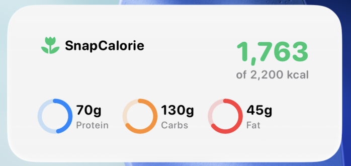

# SnapCalorie iOS Widget Prototype 🍏

This repository contains a working prototype of an iOS Home Screen widget designed for **SnapCalorie**. As a daily user of the app, I built this to demonstrate how a quick-glance macro and calorie tracker could look and function on iOS.

Since the main SnapCalorie app is built using **Expo and React Native**, this prototype was specifically structured to bridge a React Native environment with native Swift iOS widgets using Expo App Groups and `@bacons/apple-targets`.

## 📂 Where to Look (Important Files)

The React Native app in this repository is purely a "tester" interface to send data to the widget. **The core focus of this repository is the native Swift widget code.**

If you want to review the widget implementation, please look at these files:

- ➡️ **`targets/widget/Widget.swift`**: This is the most important file. It contains the entire SwiftUI interface, the Timeline Provider, and the data models for the widget.
- ➡️ **`targets/widget/expo-target.config.js`**: Contains the App Group entitlements required to share data between Expo and the iOS system.
- ➡️ **`app/index.tsx`**: The React Native tester app. It uses `ExtensionStorage` to push simulated user data (Calories, Protein, Carbs, Fat) to the shared iOS App Group.

## 🚀 How to Test it Locally

You can test the widget in real-time using the included Expo app simulator:

1. Clone the repository and run `npm install`.
2. Generate the native iOS folders by running `npx expo prebuild --clean`.
3. Start the iOS simulator by running `npx expo run:ios`.
4. Once the app opens, use the sliders to adjust the calories and macros, then tap **"Update Widget"**.
5. Go to the iOS Simulator Home Screen, long-press the background, tap the **+** icon, and add the **SnapCalorie** widget to see the data update dynamically!
